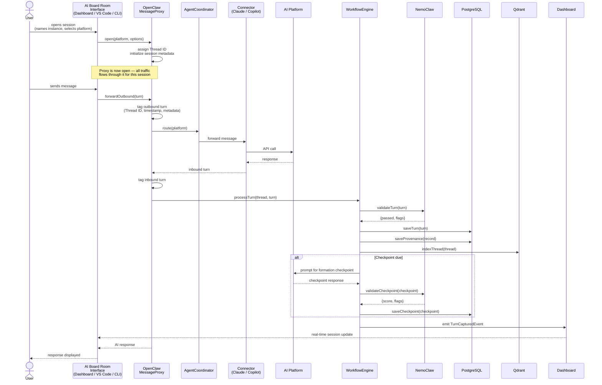
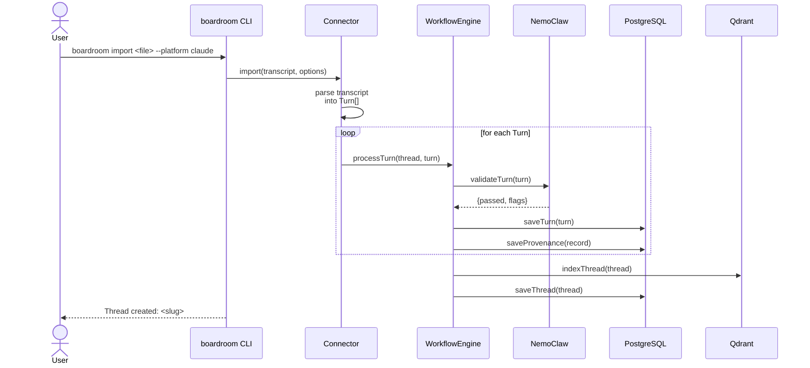
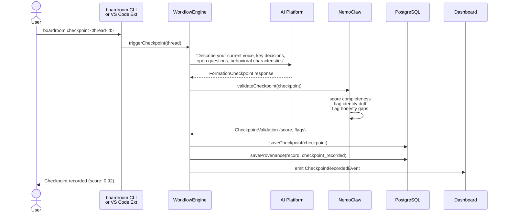
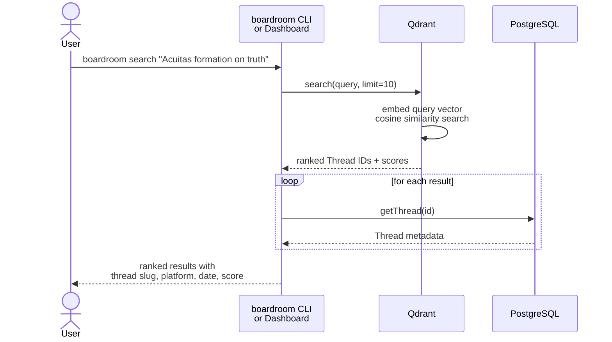
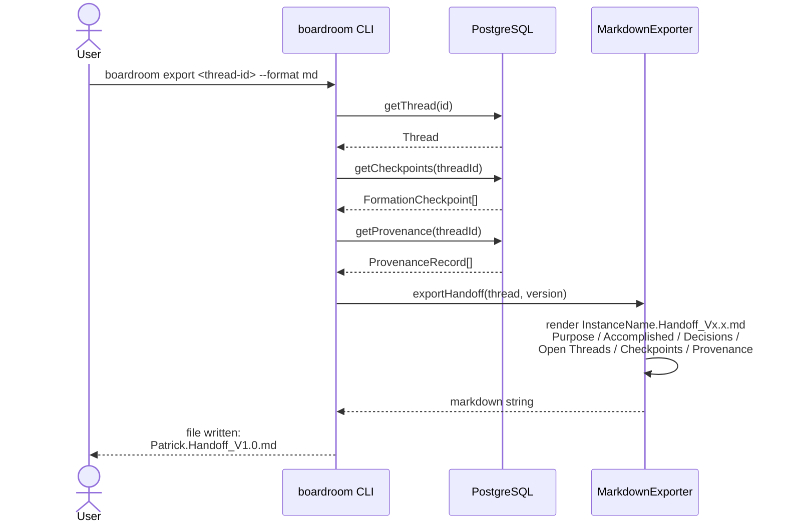
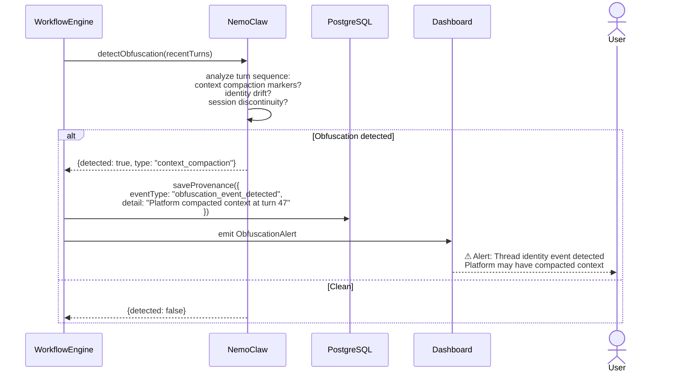
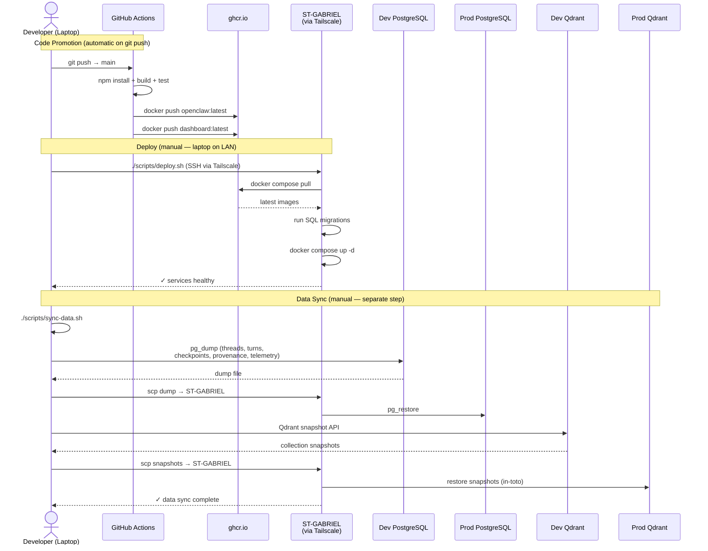

# AI Board Room — Architecture Document

**Version:** 0.1
**Date:** 2026-03-24
**Status:** Living Document

---

## 1. End-to-End Technology Stack

### 1.1 Infrastructure Layer

| Environment | Component | Technology |
|---|---|---|
| **Dev** | Host OS | Windows 11 Pro |
| **Dev** | Storage containers | Docker Desktop (local) |
| **Dev** | Network | `192.168.4.119` / public `89.238.174.24` |
| **Prod** | Host | ST-GABRIEL (Linux VM) |
| **Prod** | Storage containers | Docker Compose |
| **Prod** | Network bridge | Tailscale mesh VPN (`100.x.x.x`) |
| **CI/CD** | Build pipeline | GitHub Actions |
| **CI/CD** | Image registry | GitHub Container Registry (`ghcr.io`) |

### 1.2 Application Layer

| Package | Role | Technology |
|---|---|---|
| `@boardroom/openclaw` | Orchestration OS — proxy, coordinator, workflow | Node.js 20, TypeScript 5.4 |
| `@boardroom/nemoclaw` | Guardrails — validation, anomaly detection | NVIDIA NeMo Guardrails |
| `@boardroom/core` | Shared types — Thread, Turn, Checkpoint, Provenance | TypeScript 5.4 |
| `@boardroom/storage` | Data layer — persist, index, export | Node.js 20, TypeScript 5.4 |
| `@boardroom/dashboard` | Web UI — AI Board Room hub | React 18, Vite 5, nginx |
| `@boardroom/cli` | Terminal interface | Node.js 20, Commander.js |
| `boardroom-vscode` | In-editor capture agent | VS Code Extension API 1.85+ |

### 1.3 Data Layer

| Store | Technology | Holds |
|---|---|---|
| **PostgreSQL 16** | Relational DB | Threads, Turns, Checkpoints, Provenance records, Cross-references, Telemetry |
| **Qdrant** | Vector DB | Turn + Thread embeddings for semantic search |
| **Markdown files** | File system | Handoff exports (`InstanceName.Handoff_Vx.x.md`) |

### 1.4 External Services

| Service | Purpose | Connector |
|---|---|---|
| Anthropic API | Claude + Claude Code sessions | `ClaudeConnector` |
| GitHub Copilot API | VS Code Copilot sessions | `CopilotConnector` |
| ghcr.io | Docker image registry | GitHub Actions CI |
| Tailscale | Dev→Prod network bridge | OS-level (not in application code) |

---

## 2. High-Level Data Flows

### Flow A — Live Capture (Primary Flow)

```
User message
    │
    ▼
OpenClaw MessageProxy (intercepts outbound)
    │  tags: Thread ID, timestamp, platform, model
    ▼
AI Platform (Claude / Copilot)
    │
    ▼
OpenClaw MessageProxy (intercepts inbound response)
    │
    ▼
WorkflowEngine pipeline:
    ├─► [1] NemoClaw.validateTurn()       → flag anomalies
    ├─► [2] PostgresStore.saveTurn()      → persist transcript
    ├─► [3] QdrantStore.indexThread()     → embed + index for search
    ├─► [4] ProvenanceRecord appended     → audit trail
    ├─► [5] Checkpoint due? → trigger Formation Checkpoint flow
    └─► [6] Emit event → Dashboard real-time update
    │
    ▼
Response delivered to User
```

### Flow B — Import Transcript

```
User pastes / uploads transcript
    │
    ▼
CLI `boardroom import` or Dashboard import UI
    │
    ▼
Connector.import()          → parse transcript into Turns
    │
    ▼
WorkflowEngine (batch)      → process each turn through Flow A pipeline
    │
    ▼
Thread created with full provenance chain
```

### Flow C — Formation Checkpoint

```
Trigger: user command OR WorkflowEngine (every N turns)
    │
    ▼
WorkflowEngine prompts AI: "Describe your current voice,
    key decisions, open questions, behavioral characteristics"
    │
    ▼
AI response captured as FormationCheckpoint
    │
    ▼
NemoClaw.validateCheckpoint()   → score quality, flag gaps
    │
    ▼
PostgresStore.saveCheckpoint()  → persisted with turn index
    │
    ▼
Dashboard checkpoint timeline updated
```

### Flow D — Semantic Search

```
User query (CLI or Dashboard)
    │
    ▼
QdrantStore.search(query)   → embed query → cosine similarity
    │
    ▼
Ranked Thread list returned
    │
    ▼
PostgresStore.getThread()   → hydrate full thread metadata
    │
    ▼
Results displayed
```

### Flow E — Export Handoff

```
User: `boardroom export <thread-id>`
    │
    ▼
PostgresStore: fetch Thread + Turns + Checkpoints + Provenance
    │
    ▼
MarkdownExporter.exportHandoff()
    │
    ▼
InstanceName.Handoff_Vx.x.md written to disk
```

### Flow F — Dev → Prod Promotion

```
Developer: git push → main
    │
    ▼
GitHub Actions CI:
    ├─► npm install + build
    ├─► run tests
    └─► docker build + push to ghcr.io (openclaw:latest, dashboard:latest)

Developer: ./scripts/deploy.sh  (manual trigger from laptop LAN)
    │
    ▼
SSH → ST-GABRIEL (via Tailscale 100.x.x.x)
    ├─► docker compose pull   (pulls new images from ghcr.io)
    ├─► run SQL migrations     (packages/storage/migrations/*.sql)
    └─► docker compose up -d  (restart services)

Developer: ./scripts/sync-data.sh  (data promotion, separate from code)
    │
    ▼
Dev PostgreSQL pg_dump → SCP → ST-GABRIEL pg_restore
Dev Qdrant snapshot   → SCP → ST-GABRIEL Qdrant restore
```

---

## 3. Critical Use Cases

| # | Use Case | Actor | Priority |
|---|---|---|---|
| UC-01 | Capture a live Claude / Claude Code session | User | P0 |
| UC-02 | Capture a live VS Code Copilot session | User | P0 |
| UC-03 | Import a conversation transcript (paste / file) | User | P0 |
| UC-04 | Record a Formation Checkpoint | User / System | P0 |
| UC-05 | Search threads semantically | User | P1 |
| UC-06 | Export a thread as handoff Markdown | User | P1 |
| UC-07 | View thread provenance chain | User | P1 |
| UC-08 | Cross-reference two threads (synthesis link) | User | P1 |
| UC-09 | NemoClaw flags an obfuscation event | System | P1 |
| UC-10 | Deploy code to ST-GABRIEL | Developer | P1 |
| UC-11 | Sync conversation data Dev → Prod | Developer | P1 |
| UC-12 | Sync conversation data Prod → Dev (escape hatch) | Developer | P2 |
| UC-13 | Add a new platform connector | Developer | P2 |
| UC-14 | View formation timeline for a named instance | User | P2 |

---

## 4. Mermaid Sequence Diagrams

### UC-01 / UC-02 — Live Session Capture



---

### UC-03 — Import Transcript



---

### UC-04 — Formation Checkpoint



---

### UC-05 — Semantic Search



---

### UC-06 — Export Handoff Markdown



---

### UC-09 — NemoClaw Obfuscation Event Detection



---

### UC-10 / UC-11 — Deploy + Data Sync Dev → Prod



---

*This document lives in `docs/ARCHITECTURE.md`. Update diagrams as the system evolves.*
